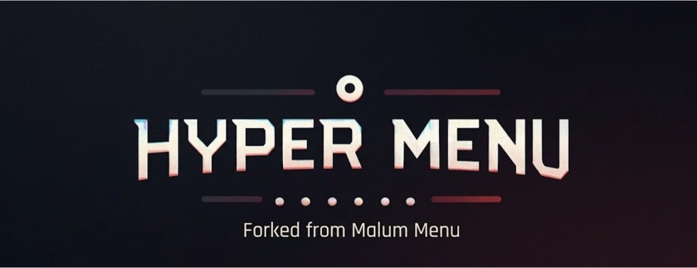
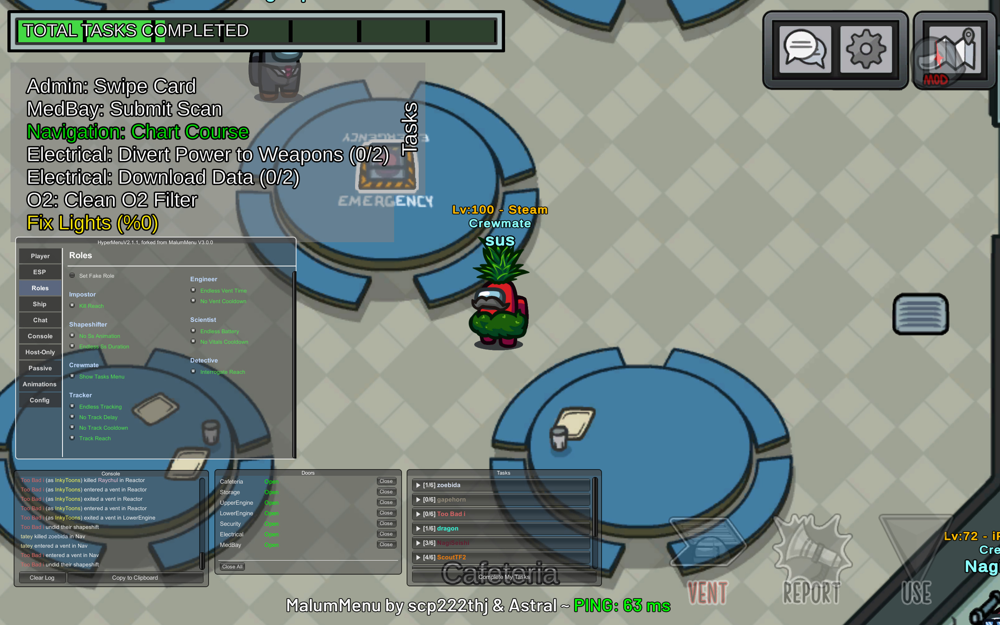

<p align="center">
  
</p>

---
# NOTICE:
* This menu is forked from the original MalumMenu. All credit goes to scp222thj.
  * To access the original, click [here](https://github.com/scp222thj/MalumMenu) or go to https://github.com/scp222thj/MalumMenu
---
## Our Discord:
https://discord.gg/HbrTNZBQk
## OG MalumMenu Discord:
https://discord.gg/GZKcdkFD5

<p align="center">
  <a href="https://discord.gg/HbrTNZBQk">
    
  </a>

  <a href="https://ko-fi.com/scp222thj">
    
  </a>

  <a href="https://github.com/astra1dev#%EF%B8%8F-support-me">
    
  </a>

  <a href="https://github.com/The-HyperMenu-Team/HyperMenu/releases">
    
  </a>

  `I don't want money from this fork as I have other sources of income. Therefore, I'm not including a button to support me. If you would like to support this project, please either support the developers of the original MalumMenu instead, as this project would not be possible without their work, or boost our discord server. -ADHyperActive`
</p>

<p align="center">
  <b>An easy-to-use Among Us cheat menu with a simple GUI and lots of useful modules.</b>
</p>

<!-- omit in toc -->

---
# NOTE: See our wiki for more information
https://the-hypermenu-team.github.io/Wiki/

---
# 😎 Table Of Contents

- [🎁 Releases](#-releases)
- [⬇️ Installation](#️-installation)
  - [🪟 Windows](#-windows)
  - [🐧 Linux](#-linux)
- [📋 Features](#-features)
- [❓ FAQ](#-faq)
- [⚠️ Disclaimer](#️-disclaimer)

# 🎁 Releases

| Mod Version| Among Us - Version | Link |
|----------|-------------|-----------------|
| v4.0.4 **[LATEST]** |  2026.3.31  | [Download](https://github.com/The-HyperMenu-Team/HyperMenu/releases/tag/v4.0.4)      |
| v4.0.0              |  2026.3.31  | [Download](https://github.com/The-HyperMenu-Team/HyperMenu/releases/tag/HYPER-4.0.0) |
| v3.0.4              |  2026.3.31  | [Download](https://github.com/The-HyperMenu-Team/HyperMenu/releases/tag/H3.0.4-02)   |
| v3.0.3              |  2026.3.17  | [Download](https://github.com/The-HyperMenu-Team/HyperMenu/releases/tag/ADV3.0.3)    |
| v3.0.2              |  2026.3.17  | [Download](https://github.com/The-HyperMenu-Team/HyperMenu/releases/tag/ADV3.0.2)    |
| v3.0.1              |  2026.3.17  | [Download](https://github.com/The-HyperMenu-Team/HyperMenu/releases/tag/ADV3.0.1)    |
| v2.1.1              |  2026.3.17  | [Download](https://github.com/The-HyperMenu-Team/HyperMenu/releases/tag/ADV2.1.1)    |
| v2.1.0              |  2026.3.17  | [Download](https://github.com/The-HyperMenu-Team/HyperMenu/releases/tag/ADV2.1.0)    |
| v2.0.1              |  2026.2.24  | [Download](https://github.com/The-HyperMenu-Team/HyperMenu/releases/tag/ADV2.0.1)    |
| v2.0.0              |  2026.2.24  | [Download](https://github.com/The-HyperMenu-Team/HyperMenu/releases/tag/ADV2.0.0)    |
| v1.0.1              |  2026.2.24  | [Download](https://github.com/The-HyperMenu-Team/HyperMenu/releases/tag/ADV1.0.1)    |
| v1.0.0              |  2026.2.24  | [Download](https://github.com/The-HyperMenu-Team/HyperMenu/releases/tag/ADV1.0.0)    |


# ⬇️ Installation

## 🪟 Windows

1. Download the latest **HyperMenu zip pack** from [here](https://github.com/The-HyperMenu-Team/HyperMenu/releases/latest).
    - **For Steam or Itch.io:** Download `HyperMenu-VERSION-Steam-Itch.zip`.
    - **For Microsoft Store, Epic Games Store, or Xbox App:** Not supported by HyperMenu. For these platforms, go to the original MalumMenu [here](https://github.com/scp222thj/MalumMenu/releases/latest).

2. Open the zip file you have just downloaded and copy all its contents.

3. Paste these files directly into your Among Us game folder:
    - **Steam:** Right-click Among Us in your Library → Click `Manage` → Click `Browse local files`.
    - **Itch.io:** Open the Itch.io app → Right-click Among Us in your Library → Click `Manage` → Click `Open folder in Explorer`.
    - **Epic Launcher:** Not currently supported by HyperMenu.
    - **Microsoft Store:** Not currently supported by HyperMenu.
    - **Xbox App:** Not currently supported by HyperMenu.

4. Launch Among Us as you normally would. You should see a console window appear, installing the mod's requirements.

5. Wait for the console window to finish the installation.

6. After installation, Among Us will automatically open with HyperMenu successfully installed.
    - By default, you can toggle the cheat GUI on by pressing **DELETE** on your keyboard.

7. If the installation doesn't work, check out our [FAQ](#-faq).

## 🐧 Linux

1. Run Among Us under **Proton (or Wine)**.
   - **In Steam:** Right-click Among Us in your Library → Click `Properties` → Click `Compatibility` → Enable `Force the use of a specific Steam Play compatibility tool`.

   - Test different Proton versions if you're having issues launching the game.

2. Set up **BepInEx** (the framework HyperMenu is built upon).
   - Follow the official Proton / Wine setup guide found [here](https://docs.bepinex.dev/articles/advanced/proton_wine.html).
   - If you are using Proton with Steam, specify the DLL override:
     - **In Steam:** Right-click Among Us in your Library → Click `Properties` → Click `General` → Click `Launch Options`.
     - Add this to your launch options:

       ```
       WINEDLLOVERRIDES="winhttp.dll=n,b" %command%
       ```

   - After that, continue with the Windows installation steps found [here](#-windows).

3. Fix crashes or errors (like `Unable to execute IL2CPP chainloader`).
   - **In Steam:** Right-click Among Us in your Library → Click `Properties` → Click `General` → Click `Launch Options`.
   - Set your launch options to:

     ```
     PROTON_NO_ESYNC=1 PROTON_USE_WINED3D=1 WINEDLLOVERRIDES="winhttp.dll=n,b" %command%
     ```

# 📋 Features



## Changes from OG Malum Menu
* Modernized GUI
* Ability to change options from the config file within the menu

## OG Menu Features
- An intuitive GUI with our latest, greatest Among Us cheats
- See ghosts & reveal the impostors
- Track every player's position using the minimap
- Teleport anywhere you want
- Change your role whenever you please
- Remove kill cooldown & spam-kill everyone
- Murder any distant player from across the map
- Unlock all of the game's cosmetics for FREE
- No more annoying disconnect penalties

For a complete list of all of MalumMenu's features, click [here](https://github.com/scp222thj/MalumMenu/blob/main/FEATURES.md)
For a complete list of all of HyperMenu's features, click [here](https://github.com/The-HyperMenu-Team/HyperMenu/blob/main/FEATURES.md)

# ❓ FAQ

Click to expand each topic

<details>

<summary><h2>❗ I'm having issues installing HyperMenu</h2></summary>

First of all, make sure you are running the most recent version of Among Us (`17.2.1` / `2026.2.24`) with the most recent version of HyperMenu (`v2.0.0`).

Also, check if your platform is officially supported:

- ✅ Steam
- ✅ Itch.io
- ❌ Epic Games Launcher
- ❌ Microsoft Store
- ❌ Xbox App
- ❌ Cracked
- ❌ iOS App Store & Google Play
- ❌ PS & Switch & Xbox Console

Now ensure that you have downloaded the correct zip file for your platform:
- **For Steam or Itch.io:** Download `HyperMenu-VERSION-Steam-Itch.zip`
- **For Microsoft Store, Epic Games Store, or Xbox App:** This is not officially supported by HyperMenu. For these features, download the original MalumMenu.

Make sure you followed the installation guide precisely. This is what your `Among Us` folder should look like after a successful installation:


<br>Some antiviruses might cause issues when installing the mod, so consider temporarily deactivating your antivirus if the game isn't booting after installation.

When installing MalumMenu for the first time, it will take **MUCH** longer than usual for the game to load. This is completely normal and expected behavior, so don't be alarmed if you have to wait a while. You can keep track of the installation progress through this useful BepInEx console window that pops up when you start the game:


<br>If you are still having issues, feel free to open a new Github issue [on the original menu](https://github.com/scp222thj/MalumMenu/issues/new), or you can ask for help in the MalumMenu Discord server: [discord.gg/YYcYf88jAb](https://discord.gg/YYcYf88jAb)

</details>

<details>

<summary><h2>👾 I found a bug OR I would like to suggest a new feature</h2></summary>

To report a bug or request a feature, you can open a new Github issue [on the original MalumMenu](https://github.com/scp222thj/MalumMenu/issues/new), or [on my fork](https://github.com/The-HyperMenu-Team/HyperMenu/issues/new) (I recommend the original since I'm unlikely to implement changes on my fork due to being busy high school student), or you can discuss it on the MalumMenu Discord server: [discord.gg/YYcYf88jAb](https://discord.gg/YYcYf88jAb)

</details>

# ⚠️ Disclaimer

This mod is not affiliated with Among Us or Innersloth LLC, and the content contained therein is not endorsed or otherwise sponsored by Innersloth LLC. Portions of the materials contained herein are property of Innersloth LLC.

Usage of this mod can violate the terms of service of Among Us, which may lead to punitive action including temporary or permanent bans from the game. The creator is not responsible for any consequences you may face due to usage. Use at your own risk.
