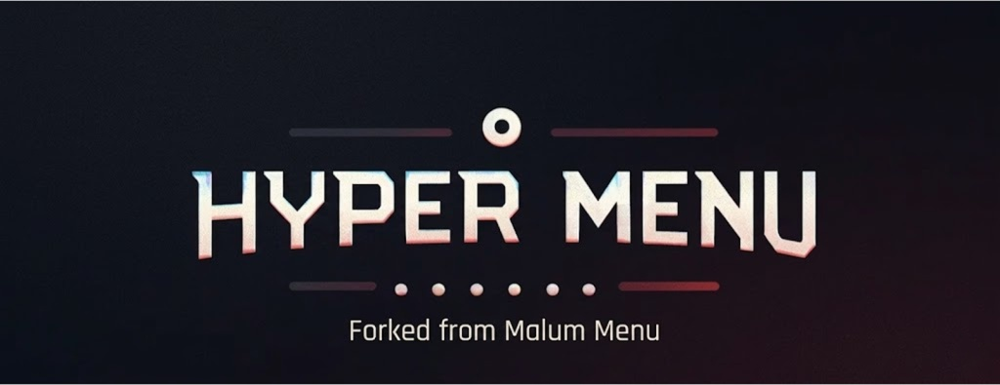

<p align="center">
  
</p>

# ⚡ HyperMenu 4.2.3 — Fixed by boranseason

> 🛠️ An unofficial community-maintained HyperMenu build with updated Among Us compatibility, Judge / voting fixes, UI improvements, profiles, hotkeys, favorites and quality-of-life features.

---

## 📌 Current Version

**HyperMenu 4.2.3**

In-game title:

```text
HyperMenu 4.2.3 - Fixed by boranseason
```

🎮 Target Among Us version:

```text
2026.8.18
```

---

## ⚖️ Judge / Meeting Voting Fix

HyperMenu 4.2.2 used older meeting APIs that became incompatible after the newer **Judge update**.

This build updates HyperMenu to the newer Among Us meeting implementation.

### 🔧 Updated APIs

- `MeetingHud.VoteStates` → `MeetingHud.MeetingStates`
- `TargetPlayerId` → `PlayerId`
- `VotedFor` → `VotedForId`
- Updated `RpcVotingComplete`
- Added Judge overrule support
- Added `overruleNonce` handling
- Updated meeting result processing
- Updated HyperMenu-specific eject logic

✅ Normal voting works again.

✅ Skip voting works again.

✅ Meeting completion has been updated.

✅ Judge-related voting logic is compatible with the newer API.

---

## 🎨 UI Improvements

The classic HyperMenu layout is still here, but several usability improvements have been added.

### ✨ Improvements

- 🔎 Tab search
- ⭐ Favorites
- ⚡ Quick access page
- ↔️ Resizable menu
- 💾 Saved menu position
- 💾 Saved menu size
- 📜 Scrollable long tabs
- 🔢 Active feature counter
- ♻️ Reset Active Features button
- 🖱️ Better buttons for one-time actions
- 📋 Classic flat tab list

Host-related pages can also be opened while playing as a client.

> ⚠️ Opening a host page does **not** magically grant host authority. Actions that require actual host permissions still depend on Among Us networking.

---

## ⭐ Favorites / Quick Menu

Frequently used features can now be marked as favorites.

Favorite options automatically appear inside the **Quick** page for faster access.

No more digging through half the menu every time you want the same feature. 😭

---

## ⌨️ Improved Hotkey System

The hotkey system has been heavily improved.

### 🎛️ Features

- 🔎 Search for features
- ⌨️ Click a key button and press a key to bind it
- `Escape` → cancel key capture
- `Backspace` / `Delete` → remove binding
- ⚠️ Duplicate key warnings
- 🌐 Network-action labels
- ⭐ Favorite support
- 💬 Hotkeys disabled while typing

This prevents accidentally triggering features while typing in chat, search boxes or profile fields.

---

## 🛡️ Private Lobby Safety

Private Lobby Safety is enabled by default.

Network-sensitive actions are restricted unless one of these conditions is met:

- 🧪 Freeplay is active
- 👑 You are the actual host
- 🔒 Private host-session confirmation has been enabled

The confirmation automatically resets after leaving the lobby.

### Protected actions include

- ☠️ Kill actions
- ⚡ Telekill
- 💀 Kill All
- 🎭 Force Role
- 🚀 Eject
- 📢 Meeting actions
- 💥 Sabotages
- 🚪 Door controls
- ▶️ Force Start
- 👑 Host-related operations
- ♾️ No Game End
- 🌐 Other network-sensitive actions

Safety checks also apply when actions are triggered using hotkeys.

---

## 🔍 Meeting Inspector

A read-only **Meeting Inspector** has been added.

It can display:

- 📊 Current meeting state
- 🗳️ Local player's vote
- 👥 Player voting states
- 🎯 Vote targets
- ⏭️ Skip vote count
- ⏳ Players still waiting to vote
- ⚖️ Judge overrule status
- 👨‍⚖️ Winning Judge
- 🎯 Overruled player
- 🔢 `overruleNonce`

> ℹ️ Meeting Inspector does not send voting RPCs and does not modify meeting results.

It only reads the current state for debugging and inspection.

---

## 💾 Improved Profile System

HyperMenu is no longer limited to a single `MalumProfile.txt`.

New profiles are stored inside:

```text
BepInEx/config/HyperMenuProfiles
```

### 📂 Profile features

- ✏️ Custom profile names
- 💾 Save profiles
- 📥 Load profiles
- 📃 List saved profiles
- ✅ Display active profile
- 🗑️ Two-step deletion
- 🚀 Automatically load active profile on startup
- 🔄 Legacy `MalumProfile.txt` compatibility

---

## 📈 Automatic Level Update

The old manual level update workflow has been improved.

HyperMenu can now automatically send the configured player level while inside a lobby.

### How it works

- ✅ Sends the selected level automatically
- 🔁 Sends again if the configured level changes
- 🚫 Does not continuously spam the RPC
- 🎮 Works during the current session

> ⚠️ This does not grant XP and does not permanently modify account progression.

It only changes the level value advertised during the active session.

---

## 🎮 Compatibility

Current target:

```text
Among Us 2026.8.18
HyperMenu 4.2.3
```

Game libraries were updated from:

```text
2026.6.5
```

to:

```text
2026.8.18
```

---

## 📥 Installation

### Steam / Itch

1. Install the required BepInEx / IL2CPP setup.
2. Copy `HyperMenu.dll` into:

```text
Among Us/BepInEx/plugins/
```

3. Remove older HyperMenu DLLs.
4. Start Among Us.
5. Press `Delete` to open the menu.

> ⚠️ Do not keep multiple HyperMenu versions inside the plugins folder at the same time.

---

## 🧱 Building From Source

### Requirements

- .NET SDK
- HyperMenu source code
- Required Among Us libraries

Restore dependencies:

```bash
dotnet restore MalumMenu.sln
```

Build Release:

```bash
dotnet build MalumMenu.sln -c Release --no-restore
```

The compiled plugin should appear inside the project's Release output directory.

---

## ✅ Tested

- ✅ Release build
- ✅ 0 build errors
- ✅ BepInEx startup
- ✅ HyperMenu 4.2.3 loaded
- ✅ UI startup
- ✅ Judge / voting compatibility update
- ✅ Single HyperMenu DLL package
- ✅ Runtime GUI test

---

## 🧑‍💻 Maintained / Fixed By

### **boranseason**

Compatibility fixes, HyperMenu-specific updates, UI improvements and additional quality-of-life work.

---

## ❤️ Credits

Huge respect to the original **HyperMenu**, **MalumMenu** and related contributors whose work made this project possible.

All original projects and code belong to their respective authors and contributors.

---

## ⚠️ Disclaimer

This is an unofficial community modification and is not affiliated with **Innersloth**.

Among Us and related trademarks belong to their respective owners.

Use modifications responsibly and preferably in private or controlled sessions where everyone involved understands that mods are being used.
